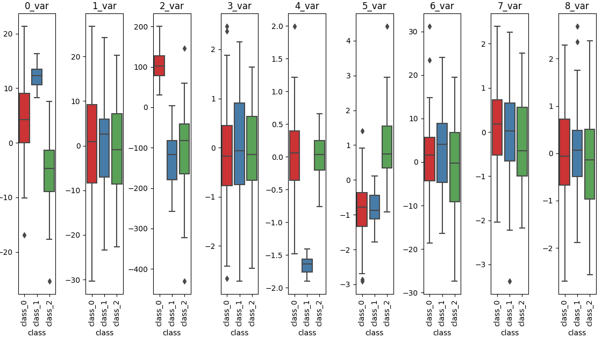
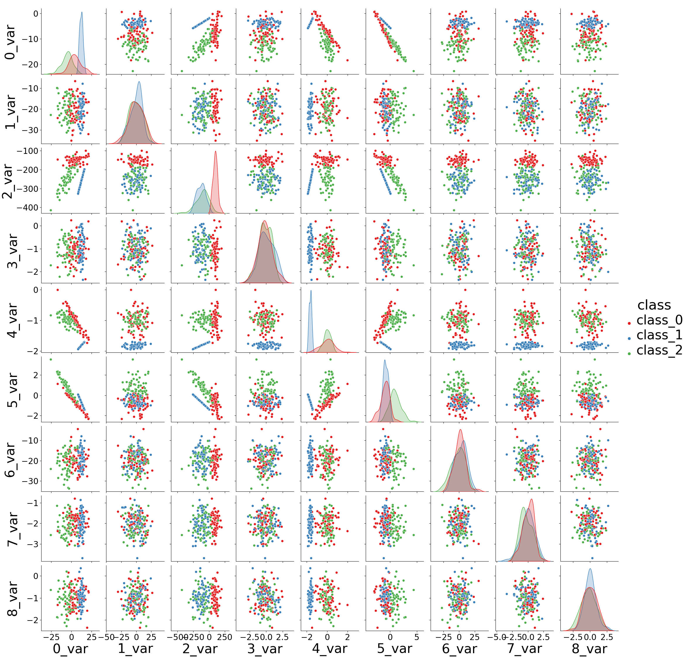
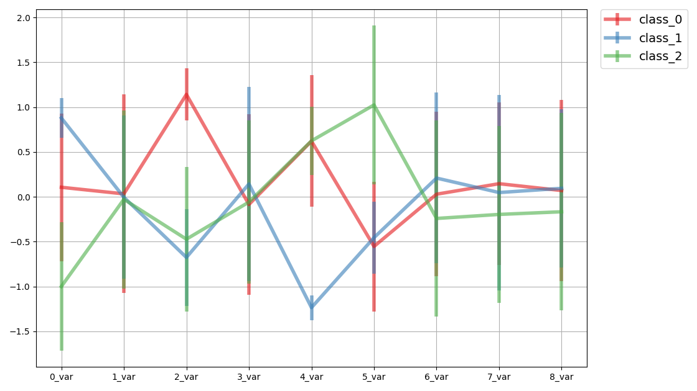

# Create virtual environment

```bash
conda env create -f conda.yaml   
```

# Plot images with mock data

```bash
python class_comparison_plots.py
```
The code create three different plots as an example of how you can visualize your data.
The plots are shown below:

## Box plot



## Pair plot



## Parallel plot



## Reusing the code

The **line 93** of the file `class_comparison_plots.py` need to be replaced with your DataFrame.
See [Pandas documentation](https://pandas.pydata.org/docs/reference/io.html) for information on how to load your data
as a DataFrame.
